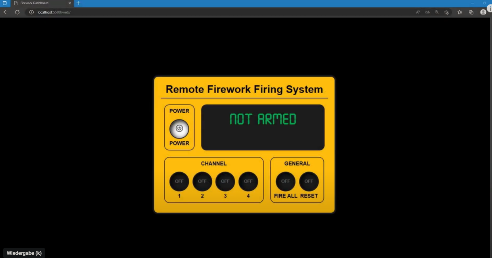

## Links:
- Youtube: https://www.youtube.com/watch?v=0VkOwpscD7w

## Key Features

- Remote firework triggering through a web console.
- Supports up to four channels for firework.

## Detailed Features

### Composition and Architecture

This IoT (Internet of Things) device is engineered using an integrative approach that combines PHP, JavaScript, and Python. At its core, it utilizes a Raspberry Pi (4B model) as the primary computing unit.

An Apache web server is installed on the Raspberry Pi, supporting PHP. Users can interact with the device through a frontend interface developed in HTML, CSS, and JavaScript. This user-friendly interface features an array of functional buttons for efficient control.

 
Function drawing:

### User Interface and Control

The device offers robust control options including:
- Power on/off capabilities.
- The ability to launch fireworks on all channels simultaneously or to activate individual channels independently.

Not armed (safe):

Armed (not safe):

Upon engaging the 'fire' button, a pre-set electric igniter is activated, triggering the fireworks.

 

Explosion 1 (test without firework):

Explosion 2 (with firework):

---

For an in-depth exploration and understanding of this web application, please refer to the build vlog and review available on YouTube. The source code is accessible for review and contribution on GitHub.
